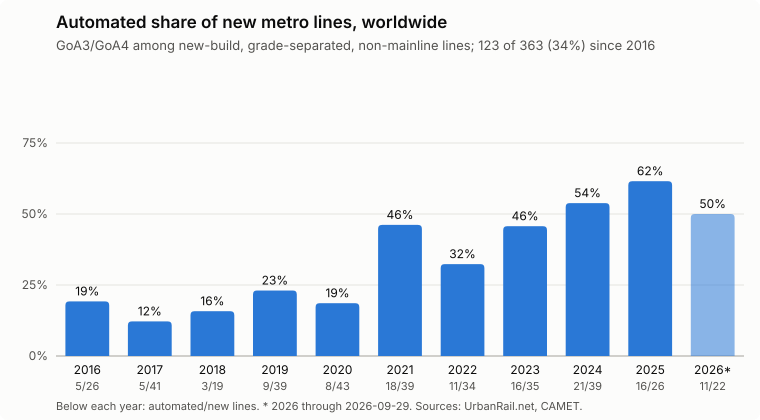

# Automated Metro Data

What share of the new metro lines opened worldwide in the last decade
are automated at GoA3 or GoA4?

This repo collects every new urban rail line opened since 2016-01-01
that is fully grade-separated and not part of the mainline railway,
tags each one with its grade of automation (GoA),
and computes the automated share.

## Scope

A line is counted if it is:

- **New-build**: an entirely new line, not an extension of an existing one.
  A line that opens in stages is counted once, at its first opening.
- **Fully grade-separated**: metro, grade-separated light rail, monorail,
  and automated people movers count; trams and street-running light rail do not.
- **Non-mainline**: metro-standard suburban lines (such as China's 市域快轨) count;
  services on mainline railways (such as S-Bahn, RER or commuter rail) do not.
- **Opened between 2016-01-01 and today**.

Lines are counted **by line**, not by km,
though the length at first opening is kept where known.

### The full openings list

To decide which openings are new lines, every opening has to be classified anyway,
so `data/urban_rail_openings.csv` lists **every** urban rail opening since 2016-01-01
that UrbanRail.net records (metro, light rail, tram, monorail, people mover,
and purpose-built suburban rail), one row per opened line or section,
sorted by opening date.
Besides the date, country, city, line, length, and GoA,
each row records:

- `mode`: what the line calls itself (metro, light rail, tram, monorail, commuter rail, and so on).
- `mainline`: whether it runs on or as part of the mainline railway.
- `grade_separated`: whether it is fully grade-separated.
- `new_build`: whether it is an entirely new line (yes) or an extension or in-fill (no).

The headline share is a filter of this list:
`new_build`, `grade_separated`, and not `mainline`.
Mainline openings that UrbanRail.net doesn't track, such as high-speed and intercity lines,
are out of scope.

### What counts as automated

A line counts as automated if it was designed and opened for
GoA3 (driverless, with an attendant on board) or GoA4 (unattended) operation.
That includes Chinese lines designated as fully automated operation (FAO) by CAMET,
which are built for unattended operation,
but often start out with a driver or attendant on board.

Lines that are only "UTO-ready" are **not** counted.
These usually have CBTC signalling
but lack the obstacle and track-intrusion detection, FAO depots, and safety certification
that unattended operation needs,
and conversions to full automation are rare.

## Findings



Of the **360 new lines** opened from 2016-01-01 through 2026-09-29
that are new-build, fully grade-separated, and not mainline,
**121 (34%) are automated** at GoA3 or GoA4.

- **The share has risen sharply.**
  It was 17% (29 of 167) for lines opened in 2016–2020,
  48% (92 of 193) in 2021–2026,
  and 56% (48 of 85) in 2024–2026.
- **China drove the rise.**
  China opened 236 of the 360 lines.
  Its automated share went from 5% (5 of 107) in 2016–2020
  to 62% (33 of 53) in 2024–2026,
  as fully automated operation became the default for new Chinese metro lines.
- **Elsewhere the share has been steadier and higher.**
  Outside China, 43% of new lines (53 of 124) are automated,
  and 54% (51 of 94) excluding India,
  whose new lines run with drivers
  except for Delhi's Magenta and Pink lines.
- Almost all automated lines are GoA4;
  the only GoA3 line is Jakarta's Jabodebek LRT.

The numbers per year are in `data/automated_share_by_year.csv`.

### Caveats

- **The line list is only as complete as UrbanRail.net.**
  China's lines were cross-checked against CAMET's per-year counts
  and per-line tables (2023 onward),
  which added one missing line (the Hangzhou–Haining intercity).
  Lines elsewhere were not cross-checked against a second source.
- **What counts as a new line is a judgment call** in edge cases,
  such as separately run branches (Shenzhen Line 6 Branch, Thessaloniki Line 2),
  lines that took over an existing service (Xi'an Line 14),
  and conversions of existing railways (Aarhus, Rotterdam's Hoekse Lijn), which are not counted.
  Each such call is explained in the `note` column.
- **The GoA of each automated line has a stated basis** (`goa_basis`).
  For mainland China it is CAMET's FAO designation,
  whose tables list every FAO line opened since 2021,
  so lines missing from them are not automated.
  For 2016–2020 it is CAMET's FAO totals,
  which leave room for only seven FAO lines (five of them opened since 2016).
  The seven Chinese lines opened in the second half of 2026 aren't in a CAMET table yet;
  their GoA comes from news coverage of their openings.
  Lines elsewhere are tagged from known operating practice.
  Lines not individually reviewed get the default for their mode,
  marked "default for the mode, not individually verified";
  that covers no automated lines, but GoA1 vs. GoA2 among them is not reliable.

## Sources

- [UrbanRail.net](https://www.urbanrail.net/news.htm):
  a year-by-year log of every opening worldwide,
  which flags entirely new lines.
- [CAMET](https://www.camet.org.cn/) (China Urban Rail Transit Association) reports:
  its bulletins' appendix table (附表2) lists every new line in mainland China
  and marks the FAO ones,
  and its annual reports list the new FAO lines for 2021 and 2022.
- News coverage of openings, for GoA where CAMET has nothing yet.
- [UITP Statistics Brief on metro automation](https://cms.uitp.org/wp/wp-content/uploads/2020/06/Statistics-Brief-Metro-automation_final_web03.pdf) (2019).

## Layout

- `data/urban_rail_openings.csv`: the full openings list, sorted by date.
- `data/automated_share_by_year.csv`: the numbers behind the chart.
- `charts/automated_share_by_year.svg`: the chart above.
- `data/curation/`: the hand-kept tables the openings list is built from:
  `events.csv` (each UrbanRail.net opening, reviewed),
  `cities.csv` (city and country names),
  and `lines.csv` (per-line mode, mainline, grade separation, and GoA).
- `data/urbanrail_events.csv` and `data/camet_new_lines.csv`: parsed source data.
- `data/raw/`: downloaded source pages and reports.
- `scripts/`: download, parse, build, and chart scripts.

## Rebuilding

```sh
./scripts/download_urbanrail.sh
./scripts/download_camet.sh
uv run --with beautifulsoup4 python scripts/parse_urbanrail.py data/urbanrail_events.csv data/raw/urbanrail/*.htm
uv run --with pdfplumber python scripts/parse_camet.py data/camet_new_lines.csv data/raw/camet/camet-*.pdf
uv run python scripts/build_openings.py
uv run python scripts/plot_share.py
```

Re-parsing UrbanRail.net keeps each event's ID,
so the reviews in `data/curation/events.csv` still apply;
new events need reviewing and adding there.
