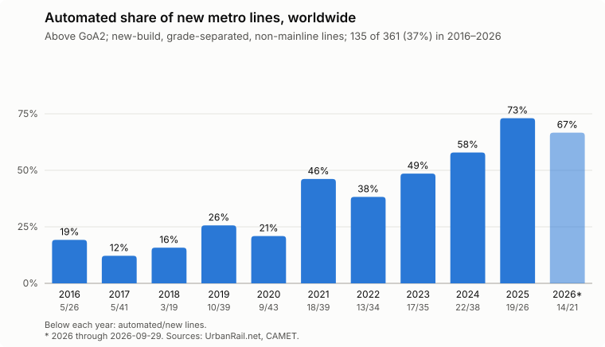
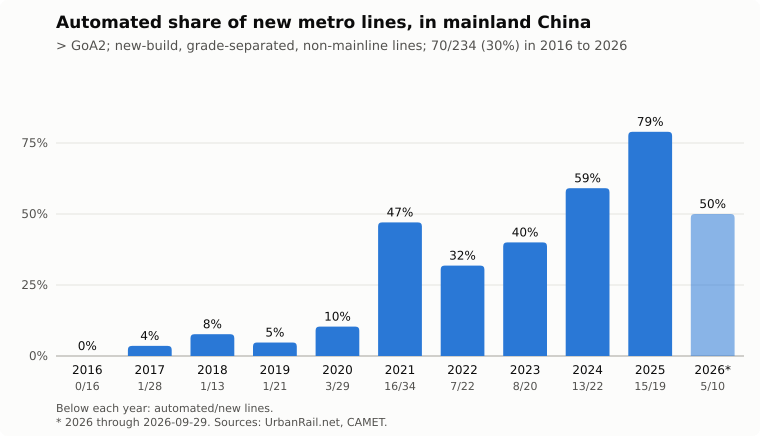
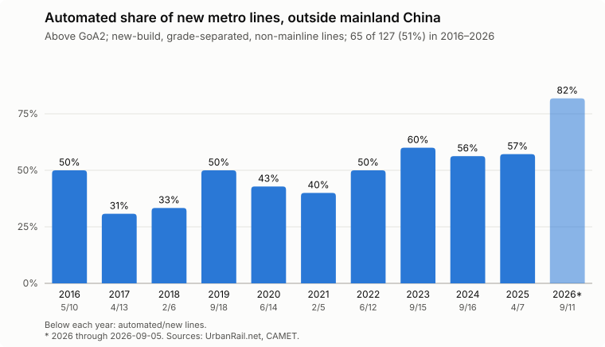

# Automated Metro Data

What share of the new metro lines opened worldwide in the last decade
are automated above GoA2?

This repo collects every new urban rail line opened since 2016-01-01
that is fully grade-separated and not part of the mainline railway,
tags each one with its grade of automation (GoA),
and computes the automated share.

## Scope

A line is counted if it is:

- **New-build**: an entirely new line, not an extension of an existing one.
  A line that opens in stages is counted once, at its first opening.
- **Fully grade-separated**: metro, grade-separated light rail, monorail,
  and automated people movers count; trams and street-running light rail do not.
- **Non-mainline**: lines built to railway standards are mainline and don't count,
  such as S-Bahn, RER, commuter rail, and China's 市域(郊)铁路 (suburban railways,
  designed under the railway standard TB 10624).
  Suburban lines built to urban rail standards, like a metro, do count,
  such as China's 市域快轨 (suburban rapid rail).
  In China, the two are told apart by the line's official category, top speed,
  and who built it;
  Shanghai's Airport Link Line and Ningbo Line 12 are the 市域(郊)铁路 among the new lines.
- **Opened between 2016-01-01 and today**.

Lines are counted **by line**, not by km,
though the length at first opening is kept where known.

### The full openings list

To decide which openings are new lines, every opening has to be classified anyway,
so `data/urban_rail_openings.csv` lists **every** urban rail opening since 2016-01-01
that UrbanRail.net records (metro, light rail, tram, monorail, people mover,
and purpose-built suburban rail), one row per opened line or section,
sorted by opening date.
Besides the date, country, city, line, length, and GoA,
each row records:

- `mode`: what the line calls itself (metro, light rail, tram, monorail, commuter rail, and so on).
- `mainline`: whether it runs on or as part of the mainline railway.
- `grade_separated`: whether it is fully grade-separated.
- `new_build`: whether it is an entirely new line (yes) or an extension or in-fill (no).

The headline share is a filter of this list:
`new_build`, `grade_separated`, and not `mainline`.
Mainline openings that UrbanRail.net doesn't track, such as high-speed and intercity lines,
are out of scope.

### What counts as automated

A line counts as automated if its GoA is above GoA2:

- **GoA4**: unattended train operation (UTO),
  including lines built for it that start out with staff on board.
  That covers Chinese lines designated as fully automated operation (FAO) by CAMET,
  which often open with a driver or attendant on board.
- **GoA3**: driverless, with an attendant on board who doesn't drive.
- **GoA2.5**: not an official grade, but used here for lines
  built for UTO, with GoA4-capable trains and signalling (and usually platform screen doors),
  that run with a driver in the cab who closes the doors and starts each departure.
  This is the norm for new Indian metro lines
  (Mumbai Lines 2A, 7, 3, 2B, and 9, Bengaluru's Yellow Line, Bhopal, and Indore).

Lines with only CBTC signalling, without those UTO features, are GoA2 and not counted.
Lines converted to UTO long after opening, such as Guangzhou Line 7
(opened 2016, FAO from December 2024), keep the GoA they opened with.

## Findings



Of the **361 new lines** opened from 2016-01-01 through 2026-09-29
that are new-build, fully grade-separated, and not mainline,
**131 (36%) are automated** above GoA2.

- **The share has risen sharply.**
  It was 18% (30 of 168) for lines opened in 2016–2020,
  52% (101 of 193) in 2021–2026,
  and 64% (54 of 85) in 2024–2026.
- **China drove the rise.**
  China opened 234 of the 361 lines.
  Its automated share went from 6% (6 of 107) in 2016–2020
  to 65% (33 of 51) in 2024–2026,
  as fully automated operation became the default for new Chinese metro lines.
- **Elsewhere the share has been steadier and higher.**
  Outside China, 48% of new lines (61 of 127) are automated,
  and 54% (51 of 94) excluding India.
  In India, 10 of 33 new lines (30%) are automated:
  Delhi's Magenta and Pink lines at GoA4,
  and eight recent lines at GoA2.5.
- Almost all of the rest are GoA4;
  the only GoA3 line is Jakarta's Jabodebek LRT.

The same, split into mainland China and everywhere else
(including Hong Kong and Macau, which CAMET doesn't cover):





Each chart also has a `2016_to_2025` version with full years only,
in which 118 of 340 new lines (35%) are automated worldwide.
Every chart also has a km version (`automated_km_share_*`),
counting the km of every grade-separated, non-mainline opening,
new lines and extensions alike, each extension taking its line's GoA:
3,313 of 11,583 km (29%) opened in 2016–2026 are automated worldwide,
23% in mainland China and 43% elsewhere.
The km share is lower than the line share because extensions,
mostly of older lines built before automation was common, add many non-automated km.
108 openings of unknown length (35 new lines and 73 extensions,
listed in `data/unknown_length_openings.csv`) are left out.
The numbers per year are in `data/automated*_share_by_year*.csv`,
named like the charts.

### Caveats

- **2026 is a partial year,** through UrbanRail.net's last entry (2026-09-29),
  and is skewed toward lines opened outside China.
  Chinese cities rush to open lines before the year ends,
  so 25–64% of each year's new Chinese lines open in December;
  none of 2026's December openings are in yet.
  With only 10 Chinese lines so far,
  a few non-automated ones (Changchun Lines 5 and 7, Nanjing Line 6,
  and two suburban lines) pull its share down to 50%,
  against 79% in 2025.
  The GoA of Chinese lines opened since July 2026 also comes from news coverage of their openings,
  since CAMET's next per-line table (around January 2027) isn't out yet.
- **The line list is only as complete as UrbanRail.net.**
  China's lines were cross-checked against CAMET's per-year counts
  and per-line tables (2023 onward),
  which added one missing line (the Hangzhou–Haining intercity).
  Lines elsewhere were not cross-checked against a second source.
- **What counts as a new line is a judgment call** in edge cases,
  such as separately run branches (Shenzhen Line 6 Branch, Thessaloniki Line 2),
  lines that took over an existing service (Xi'an Line 14),
  and conversions of existing railways (Aarhus, Rotterdam's Hoekse Lijn), which are not counted.
  Each such call is explained in the `note` column.
- **The GoA of each automated line has a stated basis** (`GoA_basis`).
  For mainland China it is CAMET's FAO designation,
  whose tables list every FAO line opened since 2021,
  so lines missing from them are not automated,
  except lines built for FAO that CAMET designated later
  (Guangzhou Line 18, designated in 2023)
  and the Pingshan SkyShuttle, an automated people mover.
  CAMET doesn't list FAO lines for 2016–2020,
  but its FAO km totals match eight pre-2021 lines,
  six of them opened since 2016,
  including the Daxing Airport Express.
  The seven Chinese lines opened in the second half of 2026 aren't in a CAMET table yet;
  their GoA comes from news coverage of their openings.
  Lines elsewhere are tagged from known operating practice.
  Lines not individually reviewed get the default for their mode,
  marked "mode default; unverified";
  that covers no automated lines, but GoA1 vs. GoA2 among them is not reliable.

## Sources

- [UrbanRail.net](https://www.urbanrail.net/news.htm):
  a year-by-year log of every opening worldwide,
  which flags entirely new lines.
- [CAMET](https://www.camet.org.cn/) (China Urban Rail Transit Association) reports:
  its bulletins' appendix table (附表2) lists every new line in mainland China
  and marks the FAO ones,
  and its annual reports list the new FAO lines for 2021 and 2022.
- News coverage of openings, for GoA where CAMET has nothing yet.
- [UITP Statistics Brief on metro automation](https://cms.uitp.org/wp/wp-content/uploads/2020/06/Statistics-Brief-Metro-automation_final_web03.pdf) (2019).

## Layout

- `data/urban_rail_openings.csv`: the full openings list, sorted by date.
- `data/automated*_share_by_year*.csv`: the numbers behind the charts.
- `charts/automated*_share_by_year*.svg`: the charts,
  by line count or by km (`_km`),
  worldwide, for mainland China (`_china`), and for everywhere else (`_ex_china`),
  each for 2016–2025 (`_2016_to_2025`) and 2016–2026 (`_2016_to_2026`).
- `data/curation/`: the hand-kept tables the openings list is built from:
  `events.csv` (each UrbanRail.net opening, reviewed),
  `cities.csv` (city and country names),
  and `lines.csv` (per-line mode, mainline, grade separation, and GoA).
- `data/urbanrail_events.csv` and `data/camet_new_lines.csv`: parsed source data.
- `data/raw/`: downloaded source pages and reports.
- `scripts/`: download, parse, build, and chart scripts.

## Rebuilding

```sh
./scripts/download_urbanrail.sh
./scripts/download_camet.sh
uv run --with beautifulsoup4 python scripts/parse_urbanrail.py data/urbanrail_events.csv data/raw/urbanrail/*.htm
uv run --with pdfplumber python scripts/parse_camet.py data/camet_new_lines.csv data/raw/camet/camet-*.pdf
uv run python scripts/build_openings.py
uv run python scripts/plot_share.py
```

Re-parsing UrbanRail.net keeps each event's ID,
so the reviews in `data/curation/events.csv` still apply;
new events need reviewing and adding there.
